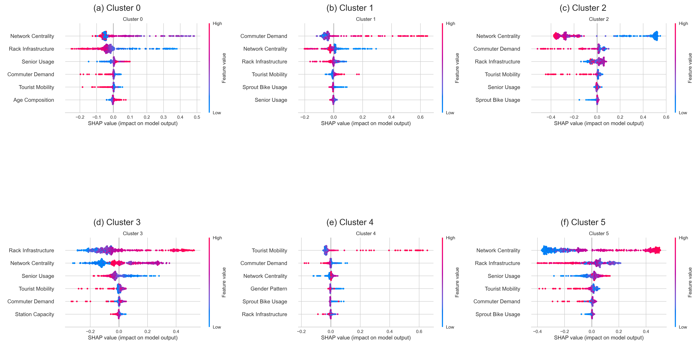
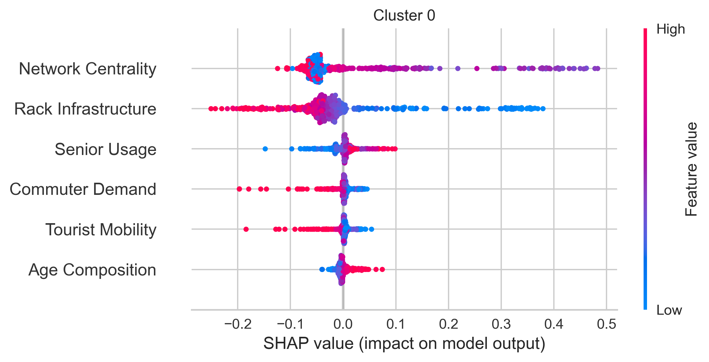
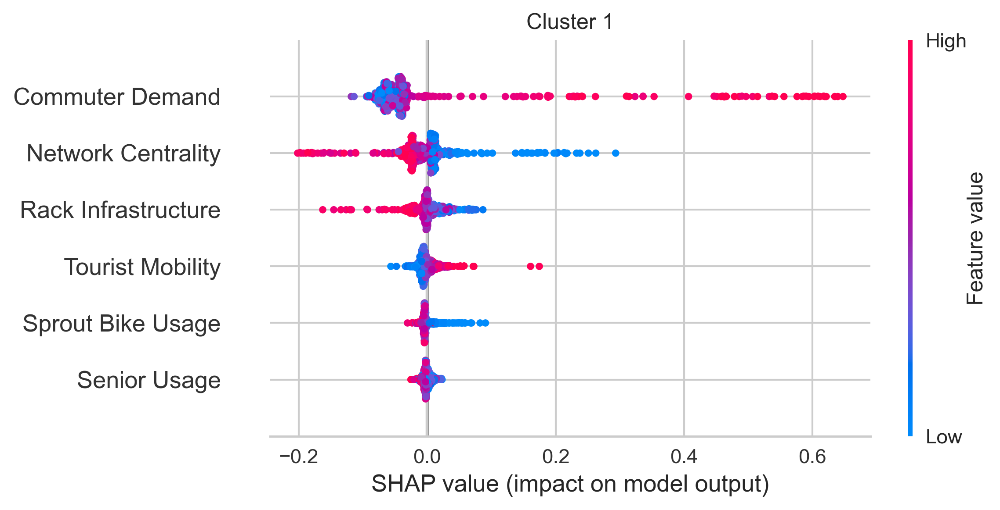
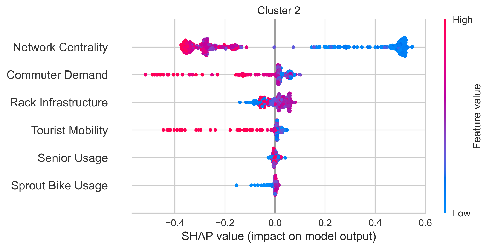
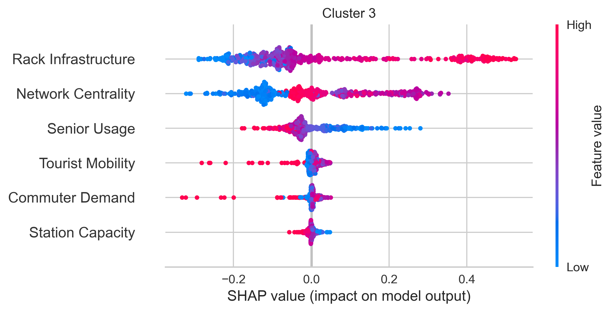
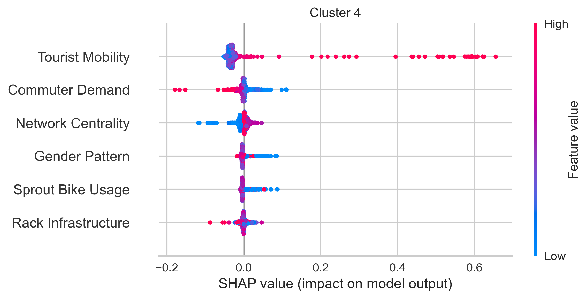
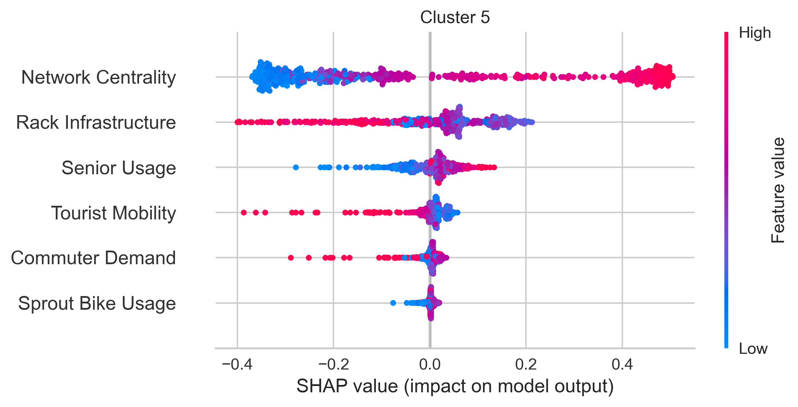

# Final Project Blog post_2

## Results
This study performed a Clustering Analysis of Seoul's public bicycle stations by incorporating usage patterns and network characteristics, rather than relying solely on location-based criteria.
To categorize the stations, the original variables were first reduced to 12 latent factors using Principal Component Analysis (PCA). The stations were clustered using the K-means algorithm, with the optimal number of clusters determined by evaluating both the Elbow method and Silhouette scores.
 The resulting clusters were then interpreted through cluster-mean heatmaps, ANOVA, Random Forest classification, and SHAP. 

 
## Cluster Interpretation

  

### Cluster 0 – Senior Residential Stations

  

This cluster is characterized by relatively high senior usage and older age composition, while showing low commuter demand, low tourist mobility, and very limited rack infrastructure.
These stations appear to serve residential neighborhoods where daily transportation needs are dominated by residents rather than commuters or tourists. 
The low network centrality further suggests that these stations are located away from major transportation corridors.
 
### Cluster 1 – Commuter Hubs

  

Cluster 1 exhibits the highest commuter demand among all clusters and above-average tourist mobility. However, network centrality and rack infrastructure remain relatively low.
 
### Cluster 2 – Network Core Stations

  

Network Centrality and Commuter Demand are below average.
Because no specific behavioral pattern strongly dominates this cluster, these stations appear to represent peripheral locations that are weakly connected to the overall bike-sharing network. 
They serve as general-purpose stations without specialized usage characteristics.
 
### Cluster 3 – Infrastructure Hubs

  

Stations in Cluster 3 have very high rack infrastructure and above-average network centrality, while senior usage is relatively low.
These stations likely operate as important transfer points within the system. Their large parking capacity allows them to support substantial bicycle circulation and redistribution activities.
 
### Cluster 4 – Tourist Destinations

  

Cluster 4 is distinguished by extremely high tourist mobility, the strongest value observed among all clusters.
At the same time, commuter demand is relatively low.
 
### Cluster 5 – Urban Core Stations

  

Cluster 5 demonstrates high network centrality combined with moderate senior usage and relatively low tourist activity.
It is less tourism-oriented and more focused on supporting everyday urban mobility.

  

The SHAP interaction plot reveals that Network(network centrality) is the most influential interaction feature in the model.

Rack capacity(station capacity) effects between Rack and Age, Senior, and Network

## Explain Results

ANOVA was conducted to determine whether the latent factors differed significantly across clusters.
1.	Network Centrality (F = 2869.27) 
2.	Rack Infrastructure (F = 843.99) 
3.	Tourist Mobility (F = 450.63) 
4.	Commuter Demand (F = 390.72)

The clustering structure is primarily driven by differences in network position, infrastructure characteristics, tourism-related usage, and commuting demand.

Random Forest Validation

The model achieved:

•	Accuracy: 96.9% 
•	Weighted F1-score: 0.97 
 
# #Reflection

The dataset is not organized by me from the website “open data plaza” which is Korean city database website. 
I downloaded 11 different dataset and made a single dataset. Rows for station and columns for feature I created. 
Idea of Features creation is “what station is most important?” I know this idea is well connected with the clustering, but I believe it would be core foundation before dataset is created.
All process is not worked well. Merging dataset is too much time consumed. Even though I use ChatGPT to generate the code for merging dataset what I made by code. 
The clustering analysis and developing idea are worked well. 

Data quality is not good enough compared to original dataset other students using.
All the feature is not cross-validate with peers. So, I think it cannot promise the quality of feature is well.
Cluster 0 and 3 are composed of similar features. SHAP also showed it. I wondered if they are actually separate clusters or if they should be merged into one.

